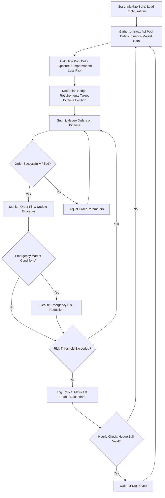

```mermaid
flowchart TD
    A[Start: Initialize Bot & Load Configurations]
    B[Gather Uniswap V2 Pool Data & Binance Market Data]
    C[Calculate Pool Delta Exposure & Impermanent Loss Risk]
    D[Determine Hedge Requirements Target Binance Position]
    
    E[Submit Hedge Orders on Binance]
    F[Monitor Order Fill & Update Exposure]
    
    G{Risk Threshold Exceeded?}
    H[Log Trades, Metrics & Update Dashboard]
    
    L{Hourly Check: Hedge Still Valid?}
    M[Wait For Next Cycle]
    
    N{Order Successfully Filled?}
    O[Adjust Order Parameters]
    
    P{Emergency Market Conditions?}
    Q[Execute Emergency Risk Reduction]
    
    A --> B
    B --> C
    C --> D
    D --> E
    E --> N
    
    N -->|Yes| F
    N -->|No| O
    O --> E
    
    F --> P
    P -->|Yes| Q
    P -->|No| G
    Q --> G
    
    G -->|Yes| E
    G -->|No| H
    
    H --> L
    L -->|Yes| M
    L -->|No| B
    
    M --> B
```
