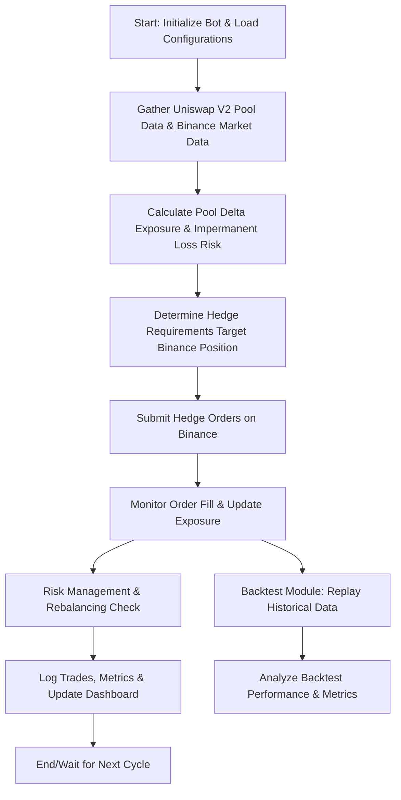

```mermaid
flowchart TD
    A[Start: Initialize Bot & Load Configurations]
    B[Gather Uniswap V2 Pool Data & Binance Market Data]
    C[Calculate Pool Delta Exposure & Impermanent Loss Risk]
    D[Determine Hedge Requirements Target Binance Position]
    E[Submit Hedge Orders on Binance]
    F[Monitor Order Fill & Update Exposure]
    G[Risk Management & Rebalancing Check]
    H[Log Trades, Metrics & Update Dashboard]
    I[Backtest Module: Replay Historical Data]
    J[Analyze Backtest Performance & Metrics]
    K[End/Wait for Next Cycle]
    
    A --> B
    B --> C
    C --> D
    D --> E
    E --> F
    F --> G
    G --> H
    H --> K
    F --> I
    I --> J
```
